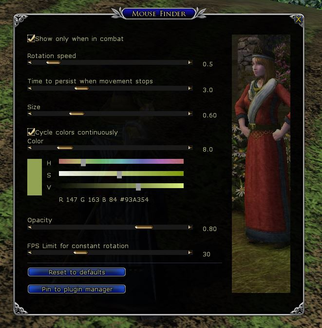
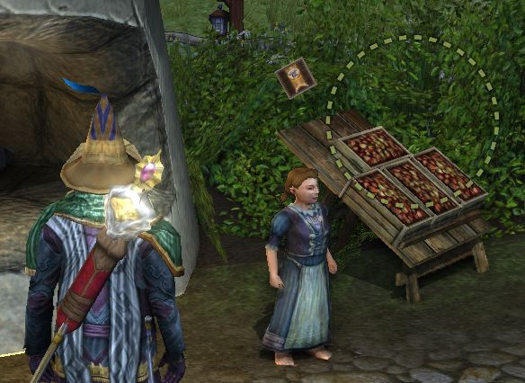

# lotro
Herr der Ringe Online Plugins

https://www.lotro.com/home

Plugins liegen lokal unter

``Dokumente\The Lord of the Rings Online\Plugins``

Lotro Interface

https://www.lotrointerface.com/index.php

## Mouse Finder

Original: Thurallor (nicht mehr aktiv)

https://www.lotrointerface.com/downloads/info924-MouseFinder.html

>If you have a hard time finding your mouse cursor on the screen during combat, this plugin will help by drawing a big rotating circle around it.

-- <cite>Thurallor</cite>

## Mouse Finder X
***Modified Version***

>This version is not a replacement of the original great Mouse Finder plugin.

You can use them side by side.

- dependencies removed
- code rewritten
- built-in color adjustment
- window opacity
- frame limit for constant rotation

Primarily i wanted to reduce code, but drifted into grid template layout engine.

Finally code reduction failed, but ok it's time to share.

> Note: This was my second plugin i wrote for lotro and i learned so much - Thanks Thurallor.

## Lotrointerface

https://www.lotrointerface.com/downloads/info1220-MouseFinderX.html
